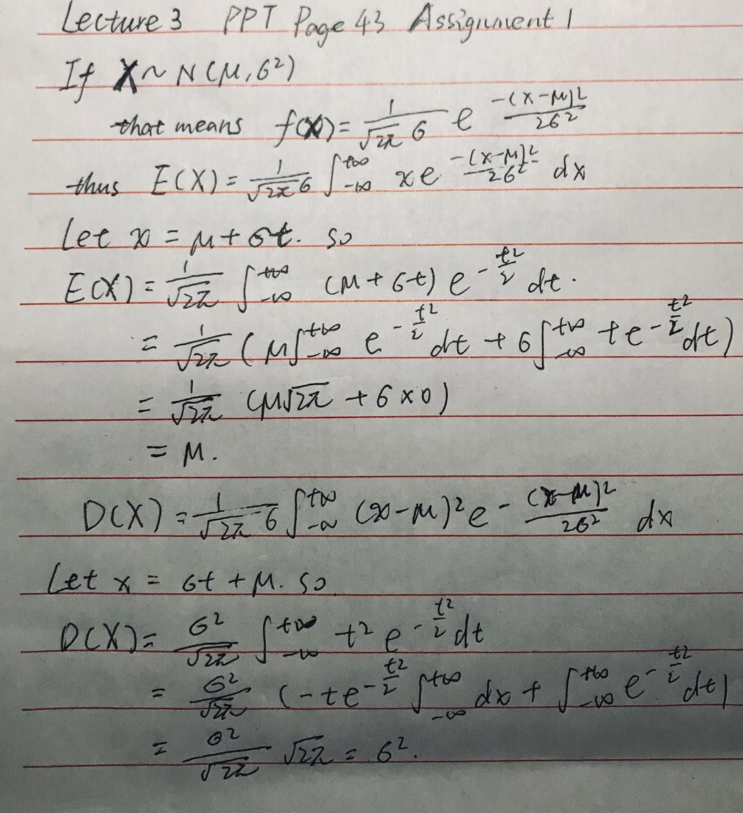

## README

Documentation for Digital Image Processing, assignment 1, lecture 3.

#### Question 1

1.  PPT page 43

2. PPT page 120

codes implemented in matlab can be find here: [q1/ada_med_filt.m](q1/ada_med_filt.m)

#### Question 2

codes implemented in matlab can be find here: [q2/gaussian_3d.m](q2/gaussian.m)

result images here: [q2/gaussian.gif](q2/gaussian.gif)

#### Question 3

code implemented in matlab:

(1) [q3/histEq_1.m](q3/histEq_1.m) codes just using functions in matlab directory, so maybe just ignore it. WIth result pictures.

(2)[q3/histEq_2.m](q3/histEq_2.m) codes implemented by myself. With result pictures [code2-1.tif](q3/code2-1.tif), [code2-2.tif](q3/code2-2.tif)

Also in python: [q3/histEqua.py](q3/histEqua.py)

#### Question 4

codes implemented in matlab:

[filter_comp.m](q4/filter_comp.m)

with comparation and result image.

#### Question 5

codes in matlab.

1. [my_gaussian.m](q5/my_gaussian.m)
2. [intensity_transform.m](q5/intensity_transform.m)